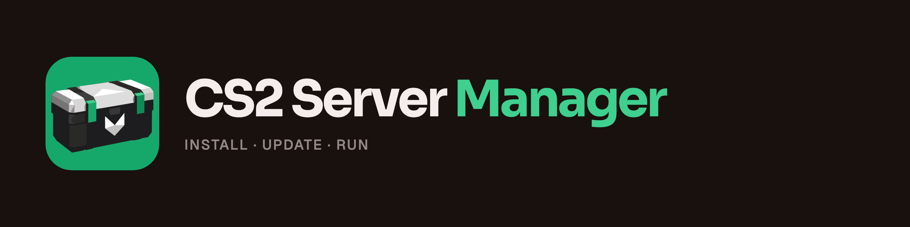

<div align="center">
  
  <p><strong>Command-line tool that installs and runs several CS2 servers on one Linux machine</strong></p>
  <p>
    <a href="https://github.com/Auto-Tournament/cs2-server-manager/releases/latest"></a>
    <a href="LICENSE"></a>
    <a href="https://docs.autotournament.gg/cs2/server-manager"></a>
    <a href="https://discord.gg/n7gHYau7aW"></a>
  </p>
</div>

<br />

csm installs CS2 with SteamCMD, puts a plugin stack on every server ([Ready Up](https://github.com/Auto-Tournament/ready-up), or the legacy Metamod + CounterStrikeSharp + [MatchZy Enhanced](https://github.com/Auto-Tournament/matchzy-enhanced)), runs each server in its own tmux session and keeps the game and plugins updated. It's for LAN organisers, small leagues and anyone running [Auto Tournament](https://github.com/Auto-Tournament/auto-tournament), which can then start, stop, create and update the servers itself.

## Features

- Interactive terminal UI and a plain CLI (`csm help`)
- Several CS2 servers on one machine, each in its own tmux session
- Instance mode: every server runs one shared install, so ten servers take about the disk space of one
- Ready Up installed and kept on its release channel on every server, or the legacy MatchZy Enhanced stack
- Automatic game and plugin updates from cron, never in the middle of a match
- Update hold while a tournament runs, set by you or by Auto Tournament
- `csm status`: process, map, phase, score and players of every server
- Host agent (`csm link`): Auto Tournament starts, stops, creates and updates servers on this machine
- Runs as its own user without sudo after a one-time `sudo csm setup-host`

## Install

On a Linux server, download the latest release to `/usr/local/bin/csm` and start the installer:

```bash
arch=$(uname -m); \
case "$arch" in \
  x86_64)  asset="csm-linux-amd64" ;; \
  aarch64|arm64) asset="csm-linux-arm64" ;; \
  *) echo "Unsupported architecture: $arch" && exit 1 ;; \
esac; \
tmp=$(mktemp); \
curl -L "https://github.com/Auto-Tournament/cs2-server-manager/releases/latest/download/$asset" -o "$tmp" && \
sudo install -m 0755 "$tmp" /usr/local/bin/csm && \
rm "$tmp" && \
sudo csm          # launches the interactive TUI installer
```

csm keeps its data under `/opt/cs2-server-manager` and logs to `/opt/cs2-server-manager/logs/csm.log`. Configs you put in `overrides/` survive game and plugin updates. Running without sudo, and what to do when `steamcmd` can't be installed: [docs/INSTALL.md](docs/INSTALL.md).

## Usage

```bash
csm                  # interactive TUI
csm status           # every server: process, map, phase, score, players
csm start [server]   # start all servers, or one
csm stop [server]    # refuses while a Ready Up match is live
csm update-game      # update CS2
csm update-plugins   # install or update the plugin stack on every server
csm link <url> <code> # let Auto Tournament control this machine
```

Every command, update holds and the host agent: [docs/USAGE.md](docs/USAGE.md).

## Documentation

Full docs at **[docs.autotournament.gg](https://docs.autotournament.gg/cs2/server-manager)**. In this repo:

- [Install: user mode and SteamCMD](docs/INSTALL.md)
- [Usage: every command, update holds, host agent, CI host](docs/USAGE.md)
- [Reference: plugin stacks, instance mode, maps, disk, database, license keys](docs/REFERENCE.md)
- [Releasing](docs/RELEASING.md)

## Contributing

See the [contributing guide](.github/CONTRIBUTING.md). Bug reports go in [Issues](https://github.com/Auto-Tournament/cs2-server-manager/issues), questions on [Discord](https://discord.gg/n7gHYau7aW).

## Sponsors

csm is part of Auto Tournament, built by one person. If your organisation runs servers with it, a sponsorship pays for development and test servers: [GitHub Sponsors](https://github.com/sponsors/sivert-io) or [Ko-fi](https://ko-fi.com/sivert).

<!-- sponsors:start -->
<!-- sponsors:end -->

## License

csm is licensed under the [PolyForm Noncommercial License 1.0.0](LICENSE). Copyright (c) 2025-2026 Sivert Gullberg Hansen. Free for non-commercial use; commercial use needs a license, see [pricing](https://autotournament.gg/pricing) and [LICENSING.md](LICENSING.md).
